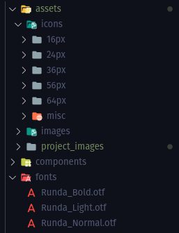
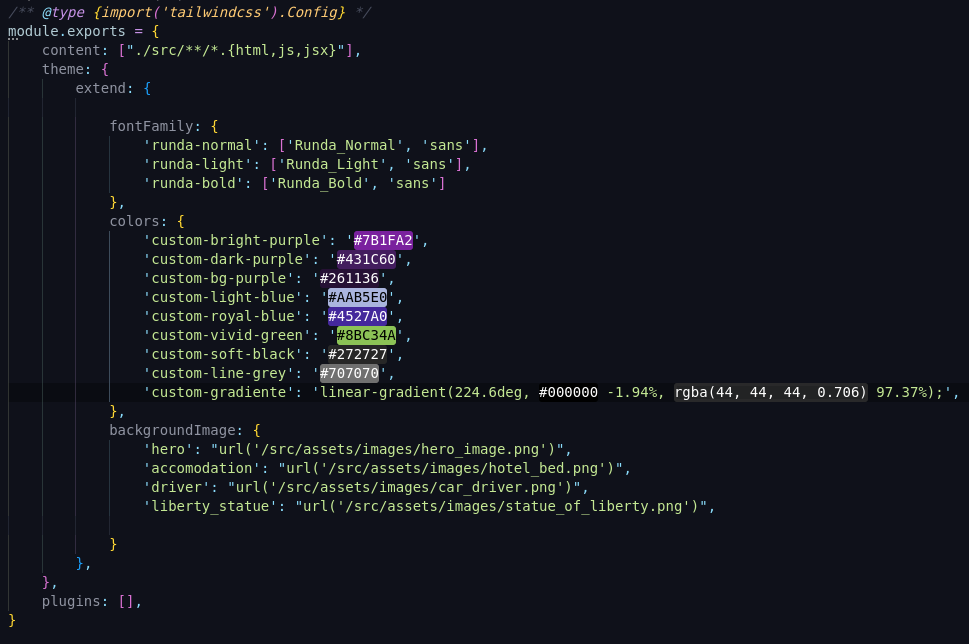

# Teste prático para vaga de Desenvolvedor Front-End UI/UX

Este projeto consiste em um teste prático para a vaga de Desenvolvedor Front-End UI/UX. O objetivo deste teste é avaliar habilidades de desenvolvimento front-end utilizando ferramentas de prototipagem, tais como Adobe XD. 

O projeto foi desenvolvido utilizando as tecnologias React, Tailwind CSS e Vite.js. A escolha de usar React se deu pela similaridade entre os componentes do protótipo enviado, o que permite o reaproveitamento de código e componentes, agilizando o desenvolvimento. Já a escolha de Tailwind CSS se deu pela habituação do desenvolvedor com a tecnologia, o que permitiu maior agilidade durante o processo de desenvolvimento.

## Como executar o projeto

Para executar o projeto, siga os seguintes passos:

1. Clone este repositório em sua máquina.
2. Instale as dependências utilizando o comando `npm install`.
3. Execute o comando `npm run dev -- --port 3000` para iniciar o servidor de desenvolvimento.
4. Acesse o endereço `http://localhost:3000` em seu navegador para visualizar o aplicativo em funcionamento.

## Processo de desenvolvimento

O processo de desenvolvimento seguiu as seguintes etapas:

1. Análise do protótipo fornecido e definição das tecnologias a serem utilizadas.
2. Criação do esqueleto do projeto utilizando o Vite.js e configuração do ambiente de desenvolvimento.
3. Organização dos diretórios como `fonts`, `components`, `pages`, `assets`, entre outros. 

4. Configuração das variaveis de desenvolvimento como, cores, fontes, imagens  
5. Criação e implementação dos componentes de cards.
6. Testes em dispositivos móveis e ajustes finais.

## Resultado final

Abaixo, segue um GIF do resultado final do projeto:

Também é possível acessar o projeto no ar por meio do seguinte link: https://teste-pratico-azure.vercel.app/

